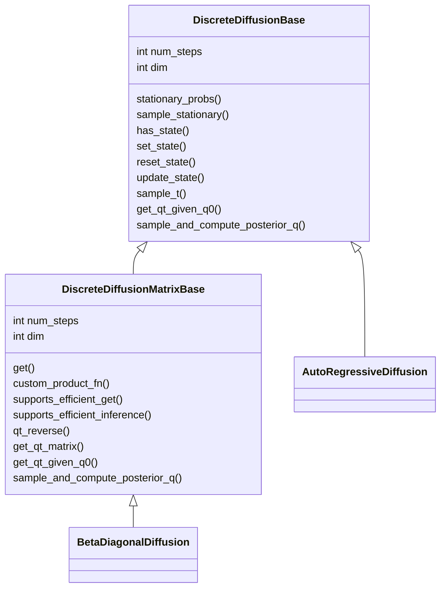

# Papers Reading & Rethinking

## Multi-labels Text Classification(MLTC)

### 相关论文

#### 传统及改进

**Label-Specific Document Representation for Multi-Label TextClassification**

​	注意力特征融合 

**SGM: sequence gen-eration model for multi-label classification**

​	Seq2Seq方式

**A novel reasoning mechanism for multi-label text classification**

**Label-Specific Dual Graph Neural Network for Multi-Label Text Classification**

​	使用了图神经网络

​	

#### Transformer 模型

**Transformer-based Label Set Generation for Multi-modal Multi-label Emotion Detection**

​	使用Transformer进行跨模态建模，使用三个Transformer-Encoder提取不同特征建模

#### 长文本建模与特征提取

**Revisiting Transformer-based Models for Long Document Classification**

​	high-level hierarchical and local attention.

​	

**An Exploration of Hierarchical Attention Transformers for Efficient Long Document Classification**

​	改进了注意力机制，减少了计算开销和复杂度

**Longformer: The Long-Document Transformer**

**Informer: Beyond Efficient Transformer for Long Sequence Time-Series Forecasting**

#### 标签数据长尾分布

**Does Head Label Help for Long-Tailed Multi-Label Text Classification**

​	构建了*Head-to-TailNetwork(HTTN)*将资源丰富的数据信息迁移至数据缺乏的数据中，使用了迁移学习

​	

- Semantic Extractor: obtain a embedding vector of document and every label by Bi-LSTM. 
- Head Classfier: train a net to transfer document vector into head label representation by cross-entropy loss.
- Transfer Learner: learn a map a constructed vector to representation.
- Authors proposed a tail labels attention module to enhance the correlation around labels.

**Multi-label Few/Zero-shot Learning with Knowledge Aggregated from Multiple Label Graphs**

​	主要做了few/zero-shot工作，重点略有不同，而且需要建图

### 论文总结

目前的研究主要聚焦于以下几点：

- 解决标签之间的相互关联问题，语义相似的标签在分类时会有混淆，因此提取并利用标签之间的相关性对于模型性能较为重要。**（暂作为本故事的一个点，存在难度，目前研究做的不错）**
- 长序列建模问题，一些文本较长，注意力机制的计算压力较大，另外如何充分提取长序列信息较为重要。**（作为一个创新点，可以直接套用informer或稍做改进）**
- 长尾标签问题，有些标签出现频率较高，有些很少（甚至只出现1次），缓解此问题可以有效提升性能。**（作为一个创新点，结合focal-loss和论文的方法）**
- 还有些研究使用图卷积等不同网络结构，结构的设计较复杂，不确定性较大，本故事不考虑。

### 故事框架

根据上述内容，计划本故事从以下几点开展

#### 总体架构

主要还是采用类LSAN的架构，采用设计2个模块并进行融合的方式，创新点体现在各个模块中，以下详细讨论。主要在于文本建模，标签的关联性学习，动态融合以及训练目标，其中 *标签关联性学习与动态融合*体现在**模型结构**中。

考虑到故事的使用场景与合理性以及对创新性的要求，因此计划突出2～3个创新之处即可，不宜过多。

#### 文本内容建模与特征提取

本部分主要是解决长文本序列建模问题，计划使用层次稀疏自注意力机制，参考**Revisiting Transformer-based Models for Long Document Classification**

#### 标签表征学习与序列解码

对所有标签进行label embedding操作，采用可学习的参数动态训练标签的向量表示，并且与文本建模后的特征进行交叉注意力机制操作，从而解码出生成的各标签对应的概率，计算损失函数进行训练。

#### 训练目标的设计

为了缓解标签长尾分布现象，本文针对性设计了损失函数，首先focal loss在计算机视觉中应用较为广泛，其原始形式为：
$$
FL(p_t) = -\alpha_t(1-p_t)^\gamma log(p_t)
$$
其中$\alpha_t$和$\gamma$为超参数，我们对其改进为：
$$
FLW(p_t) = -\omega_t\alpha_t(1-p_t)^\gamma log(p_t)
$$
其中$\omega_t$由训练集中的词频决定

另外，为了增强模型的训练和区分性能，本文还设计了对比损失函数用于更好的区分模型生成各个标签向量。

因此总损失函数为：
$$
L=\lambda_f*FLW + \lambda_c*CL
$$
其中$\lambda_f$和$\lambda_c$为参数，满足$\lambda_f+\lambda_c=1$

----

## diffusion models

### Denoising Diffusion Probability Model (DDPM)

from **Google Research**

#### Paper and Mathematic

**(1) diffusion process**

Add the noise which is Gaussian distribution with parameter $\beta_{t}$ on $x_{t-1}$ to obtain the next state $x_{t}$. That is:
$$
q(x_{t}|x_{t-1}) = N(x_t; \sqrt{1-\beta_{t}}x_{t-1}, \beta_tI)
$$
Then we can infer the $q_t$ given $q_0$, we define $\alpha_t=1-\beta_t$:
$$
x_t =\sqrt{\alpha_t}x_{t-1} + \sqrt{1-\alpha_t}z_{t-1}\\
=\sqrt{\alpha_t}(\sqrt{\alpha_{t-1}}x_{t-2} + \sqrt{1-\alpha_{t-1}}z_{t-2}) + \sqrt{1-\alpha_t}z_{t-1}\\
=...\\
=\sqrt{\bar{\alpha_{t}}}x_{0} + \sqrt{1-\bar{\alpha_{t}}}z
$$
which $\bar{\alpha}_{t}=\prod^{t}_{i}\alpha_{i}$

So we can get $q(x_t|x_0)$:
$$
q(x_t|x_0) = N(x_t;\sqrt{\bar{\alpha}_{t}}x_0, \sqrt{1-\bar{\alpha}_{t}}I)
$$

Next, we infer the denoising process, which we want the $x_{t-1}$ given $x_t$ and $x_0$. It is so difficult to compute the posterior, so we use the Bayias
$$
q(x_{t-1}|x_t, x_0) = \frac{q(x_t|x_{t-1},x_0)q(x_{t-1}|x_0)}{q(x_t|x_0)}
$$

### Structured Denoising Diffusion Models in Discrete State-Space

from **Google Research, Brain Team**

#### Paper

diffusion models for discrete state space

(1) the diffusion process
$$
q(x_t|x_{t-1})=Cat(x_t;p=x_{t-1}Q_{t})\\
q(x_t|x_0) = Cat(x_t;p=x_0\bar{Q_t})\\
q(x_{t-1}|x_t,x_0)=\frac{q(x_t|x_{t-1},x_0)q(x_{t-1}|x_0)}{q(x_t|x_0)}=Cat(x_{t-1};p=\frac{x_tQ_{t}^{T}\odot x_0\bar{Q}_{t-1}}{x_0\bar{Q}_{t}x_{t}^{T}})
$$

#### Code analyze

### Diffusion Models for Medical Anomaly Detection

**Authors: ** Julia Wolleb et. al

**College: ** University of Basel

**Publisher: ** MICCAI 2022

#### main contribution

* present a novel **weakly supervised anomaly detection method ** based on **denoising diffusion implicit models**
* combine the deterministic iterative noising and denoising  scheme with classifier guidance for image-to-image translation

#### Method

the method consist two main parts.

* **First part**

Train a DDPM and a binary classifier on dataset of healthy and diseased.

* **Second part**

Create the actual anomaly map of an unseen image.

##### main process

* add the noises on original image by DDIM $x_t=ddim(x_0)$
* denoising the $x_t$ to get the $\hat{x_0}$ which is the healthy image
* the anomaly map is the difference between the original and synthetic image $x_{anomaly} = x_0 - \hat{x_t}$

The method can preserve many details of the input image that are not affected by the disease while re-paiting the diseased part with realistic looking tissue.

该方法可以保留图像中不受疾病影响的细节，同时通过真实的组织重新描绘病灶。

##### datasets

* BRATS2000
* CheXpert

##### Code

https://anonymous.4open.science/r/diffusion-anomaly-DB51 (not available)

https://github.com/JuliaWolleb/diffusion-anomaly

##### More Details

The forward noising process q with variances $\beta_1,...,\beta_T$ is definde by
$$
q(x_t|x_{t-1}):=N(x_t;\sqrt{1-\beta_t}x_t, \beta_tI)
$$
This recursion can be written explicity as 
$$
x_t = \sqrt{\bar{\alpha}_t}x_0 + \sqrt{1-\bar{\alpha}_t}\epsilon
$$
The denoising process $p_\theta$ is learned by optimizing the model parameters $\theta$ :
$$
p_{\theta}(x_{t-1}|x_t) := N(x_{t-1}; \mu_{\theta}(x_t, t), \sum_{\theta}(x_t, t))
$$
The output of  the U-Net is denoted as $\epsilon_{\theta}$ , and the MSE loss used in training:
$$
L := \|\epsilon - \epsilon_{\theta}(\sqrt{\bar{\alpha}_t}x_0 + \sqrt{1-\bar{\alpha}_t}\epsilon, t)\|_{2}^{2}
$$
In this task (anomaly detection), authors train a DDPM on a dataset contain images of helthy and diseased subjects.

In addition, the classifier guidance was applied to generate the desired image. So we need to pretrain a classifier

---

### DiffusionBERT: Improving Generative Masked Language Models with Diffusion Models

from **Fudan University**

- exploring to utilize the diffusion model in Pre-training Language Model(**PLMs**)
- proposing a novel forward noisy strategy about descrete data
- using BERT with diffusion model to achieve significant improvement in **unconditional text generating**

#### Main Contribution

1. 经典的扩散模型的前向过程（**加噪扩散过程**）都是马尔可夫过程，在离散数据的扩散过程中采用了状态转移矩阵来实现token的破快与加噪
2. 本文探究了结合预训练模型**（BERT）**来进行文本词语的去噪过程，并且证明了该方法可**加速收敛，生成质量高**
2. 提出一种新的前向过程*spindle schedule*，**基于均匀分散于破坏信息的原则**，在生成$x_t$时不仅仅依靠$x_{t-1}$同时还依赖于$x_0$。这种方法是一种非马尔可夫过程，但是训练目标不变
2. 在去噪过程中时刻$t$是不可见的，使用了各种手段将$t$融合到预训练语言模型中

##### Spindle Noise Schedule

首先，扩散过程的加噪策略**(Linear / Cosine)**对于扩散模型的性能影响较大。在连续空间中，加噪的方式可以很方便地通过高斯分布的变量参数来控制，但是在*离散空间*中：

1. 无法明显的得知如何控制每一步加噪的程度；
2. 现有的加噪策略都假设了**所有单词都携带相同的信息并且没有考虑到单词在句子中的语义差异**、
3. 违反了去噪语言模型的***easy-first-generation nature***.

为了解决上述的问题，this paper proposed a novel noise schedule：

- measures the added noise at each time step by the corrupted informattion  to be uniformly distributed
- different tokens in a sequence are assigned different probabilities of transitioning to [MASK] token
- we put the tokensin a sequence in descending order of their information and divide then into T buckets.

----

## Poisson Flow Generative Models (PFGMs)

### Poisson Flow Generative Models

Yilun Xu & Ziming Liu

*MIT*

### Beta 分布

贝塔分布（Beta Distribution) 是一个作为[伯努利分布](https://baike.baidu.com/item/伯努利分布/7167021?fromModule=lemma_inlink)和二项式分布的[共轭先验分布](https://baike.baidu.com/item/共轭先验分布/15696678?fromModule=lemma_inlink)的[密度函数](https://baike.baidu.com/item/密度函数/12721265?fromModule=lemma_inlink)。

概率密度函数：

随机变量X服从参数为$\alpha$，$\beta$的Beta分布写作：
$$
X～Be(\alpha,\beta)
$$

**Beta分布的性质：**

Beta分布的一个实例为空气相对湿度。

----

## Context Understanding in Computer Vision: A Survey

- Appearance context information can improve the recognition accuracy of the object in the scense.
- Semantic context will improve the accuracy and exclude unrelated events.

**Categodize context into different types**

- spatial context (*location of the target*)
- temporal context (*nearby frames*)
- other context *like prior knowledge*

### Roles of context

本节论述了上下文信息在人脑和机器中的不同处理方式，并且试图解释为什么上下文关联在计算机视觉中是困难且重要的

#### Context in Human

人脑可以**经验性地/先验地**通过上下文信息（主要是环境信息）推断物体的种类等，例如一个模糊的键盘孤立地出现不容易推断但是放在一张照片中则更容易推断出。

**非视觉信息**也可以提供重要的知识，例如即使没有看过图片，只是知道图片中有船，那么便可以容易地知道可能有河或者海

这种能力机器是较弱的，导致这种差异的潜在的原因在于:

- 机器与人脑有不同的学习机制，计算机从有限的数据和特性的上下文环境中学习，而人可以从多样的真实世界中学习；
- 机器试图学习人类的视觉 (**trying to mimic human vision** ), but human vision is more advanced with the help of brain. 人类不仅可以学习目标和上下文，而且可以很容易建立相关的联系并形成记忆。

#### Context in Compute Vision

computer captures single object easily but lack of relation between them.

----

## High-resolution image reconstruction with latent diffusion models from humanbrain activity

**Authors:** Yu Takagi; Shinji Nishimoto

**Address:** Osaka University

**main contributions:**

- propose a new method based on a diffusion model to reconstruct images from brain activity obtained via fMR;
- characterize the inner mechanisms of the LDM by studying how its dfferent components relate to distinct brain functions

从人脑活动中(fMRI)中重建图像是一个有趣(intriguing)而难度的任务，因为潜意识的表达大部分是未知的，并且图像于大脑数据的联系是很弱的。

目前研究需要训练一个新的生成模型，但是限制其成功的因素一部分在于数据量较少，一部分原因在于训练复杂生成模型的困难

### 研究方法

#### 数据集

[Natural Scenes Dataset(NSD) ](http://naturalscenesdataset.org/) 

MS COCO

#### 模型

